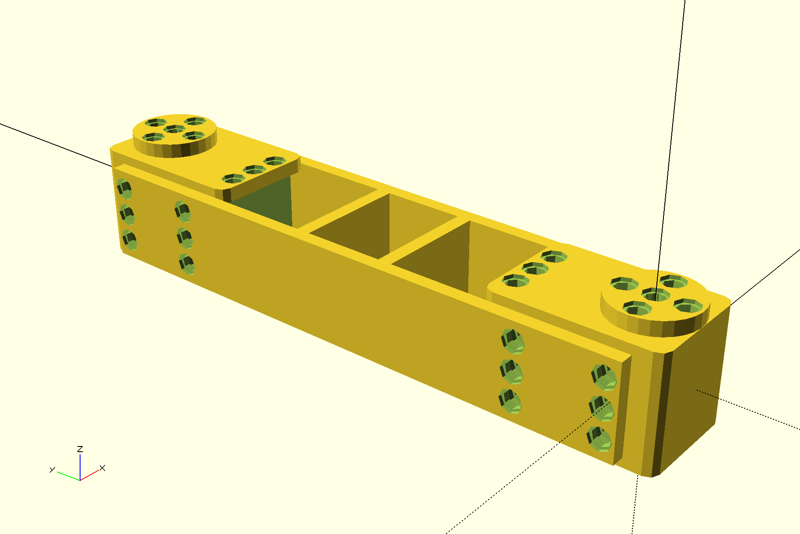
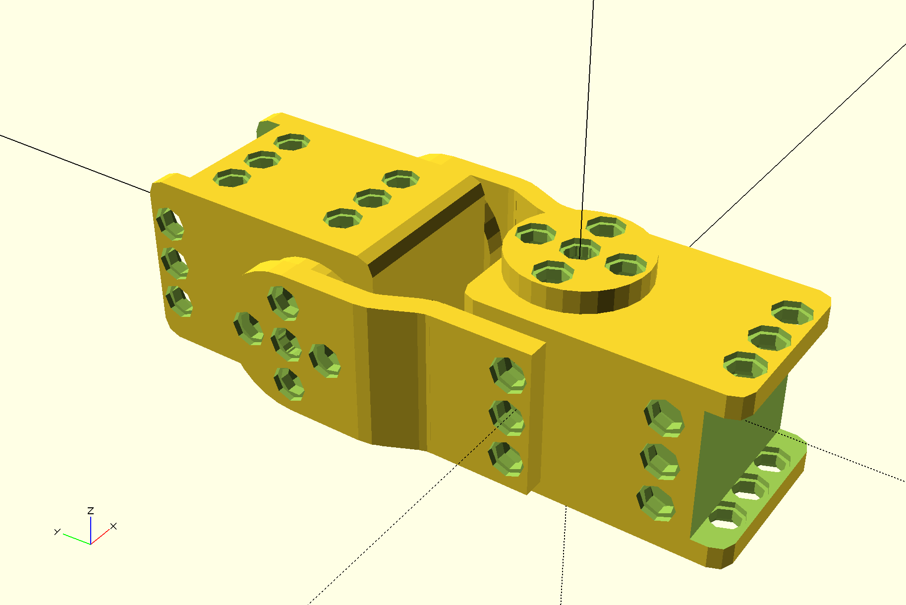
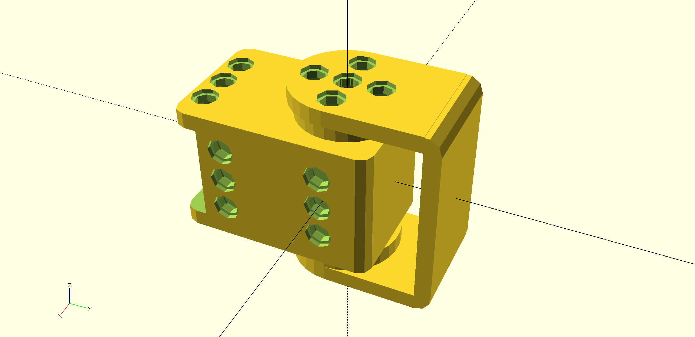
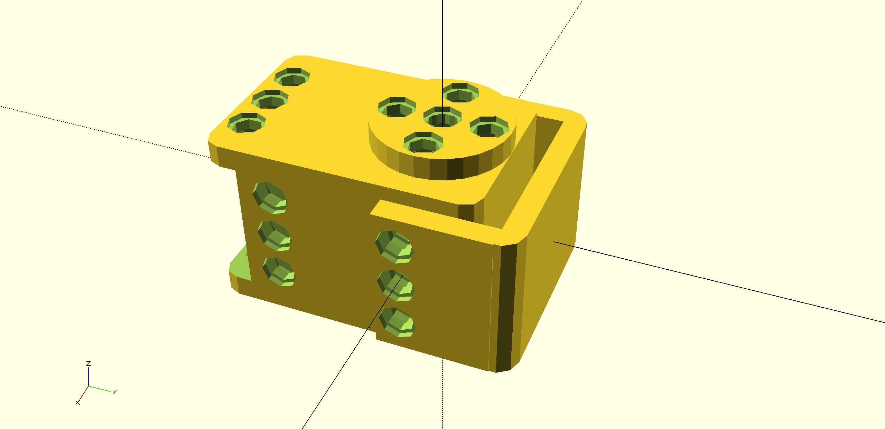
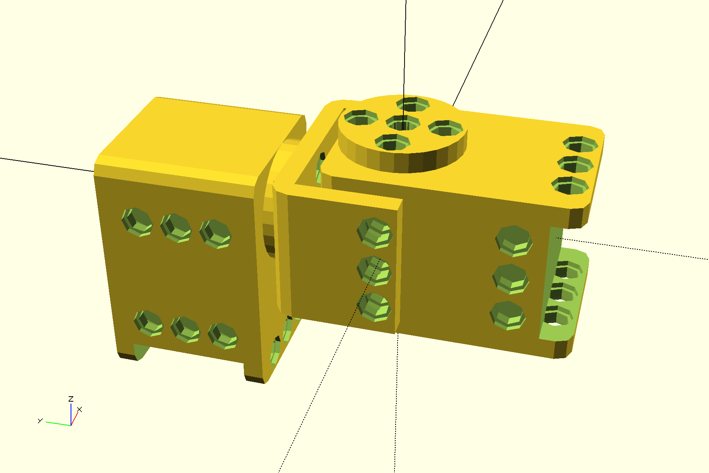

# robotis-scad

Tools to create frame connecting XL320 motors and various elements from the [OLLO framework](http://www.robotis.com/xe/ollo_en) from [Robotis](http://en.robotis.com/index/). Most tools are based on [segment-scad](https://github.com/jgrizou/segment-scad), an [OpenScad](http://www.openscad.org/) library to create parametrable and linkable segments.

### Dependencies:

- OpenScad must be installed on your computer: http://www.openscad.org/downloads.html
- This [MCAD fork](https://github.com/jgrizou/MCAD) must be located at the same level as this folder.
- The [segment-scad library](https://github.com/jgrizou/segment-scad) must be located at the same level as this folder.

### Get started:
```
mkdir myfolder
cd myfolder
git clone https://github.com/jgrizou/MCAD
git clone https://github.com/jgrizou/segment-scad
git clone https://github.com/jgrizou/robotis-scad
```

The repository is divided in five folders:

- The [ollo](ollo) folder contains constants and tools related to the OLLO framework, such as holes for rivets, thickness of elements.
- The [dynamixel](dynamixel) folder contains constants and tools for the XL320 motors.
- The [ollo_segments](ollo_segments) folder contains a specialization of the [segment-scad tools](https://github.com/jgrizou/segment-scad). Typically segment with predefined width, thickness, and holes.
- The [frames](frames) folder is the most useful one, it contains ready to use frames for connecting XL320 motors in various ways.
- The [specific_frames](specific_frames) folder contains more specific frame that are used for various robots.

Each *_frame.scad file contains function for a specific type of frame. Each frame file contains small examples at the end of the file, the simplest way to run it is to open the file in OpenScad.

Most frames comes with a function starting by add_* which creates the frame and add the forthcoming segments at the opposite side of the frame.

You are invited to look and play with the code for more details, function names and arguments are usually self-explanatory. Please check the [poppy-ergo-jr project](https://github.com/poppy-project/poppy-ergo-jr) to see examples of how to use these tools. Below are example of code for each frame and pictures of the resulting 3D parts.

### Frames

- [horn_to_horn_frame.scad](horn_to_horn_frame.scad)

```
use <dynamixel/xl320.scad>
use <frames/horn_to_horn_frame.scad>

rotate([0,90,0])
  xl320_two_horns();
horn_to_horn_frame(50);
```


- [side_to_side_frame.scad](side_to_side_frame.scad)

```
use <dynamixel/xl320.scad>
use <frames/side_to_side_frame.scad>

rotate([0,0,180]) xl320();
add_side_to_side_frame(100,2)
  xl320();
```



- [three_ollo_frame.scad](three_ollo_frame.scad)

```
include <ollo/ollo_def.scad>

use <dynamixel/xl320.scad>
use <frames/three_ollo_frame.scad>

xl320();
add_three_ollo_frame(50)
translate([0,4*OlloSpacing,0])
  rotate([0,-90,0])
    xl320();
```


- [three_ollo_to_horn_frame.scad](three_ollo_to_horn_frame.scad)

```
use <dynamixel/xl320.scad>
use <frames/three_ollo_to_horn_frame.scad>

xl320();
add_three_ollo_to_horn_frame(length=30, nLayer=1)
  rotate([0,90,180])
    xl320_two_horns();
```



- [U_horn_frame.scad](U_horn_frame.scad)

```
use <../dynamixel/xl320.scad>
use <frames/U_horn_frame.scad>

xl320_two_horns();
  U_horn_frame(20);
```



- [U_horn_to_horn_frame.scad](U_horn_to_horn_frame.scad)

```
include <ollo/ollo_def.scad>
include <dynamixel/xl320_def.scad>

use <dynamixel/xl320.scad>
use <frames/U_horn_to_horn_frame.scad>

xl320_two_horns();
add_U_horn_to_horn_frame(20)
  translate([0,MotorWidth/2+OlloLayerThickness,0])
    rotate([90,0,0])
      xl320();
```


- [U_horn_to_U_horn_frame.scad](U_horn_to_U_horn_frame.scad)

```
use <../dynamixel/xl320.scad>
use <frames/U_horn_to_U_horn_frame.scad>

xl320_two_horns();
  add_U_horn_to_U_horn_frame(50)
    rotate([0,0,180])
      xl320_two_horns();

```


- [U_three_ollo_frame.scad](U_three_ollo_frame.scad)

```
use <../dynamixel/xl320.scad>
use <frames/U_three_ollo_frame.scad>

xl320();
U_three_ollo_frame(15);
```




- [U_three_ollo_to_horn_frame.scad](U_three_ollo_to_horn_frame.scad)

```
include <ollo/ollo_def.scad>
include <dynamixel/xl320_def.scad>

use <dynamixel/xl320.scad>
use <frames/U_three_ollo_to_horn_frame.scad>

xl320();
add_U_three_ollo_to_horn_frame(15, 1.5)
  translate([0,MotorWidth/2+OlloLayerThickness,0])
    rotate([90,0,0])
      xl320();
```




### Specific Frames
